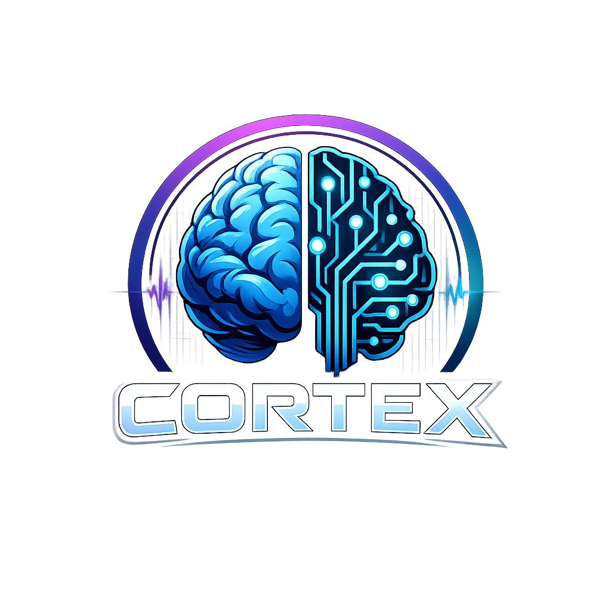

<p align="center">
  
</p>

Privacy-first, ASD-friendly AI copilot for engineering work. Runs locally on NVIDIA GPU hardware.

## What is this?

Cortex is a personal AI operating system for engineering work. It reduces cognitive load, eliminates ambiguity, and provides predictable structure for task planning, meeting analysis, and stakeholder communication.

Runs on any machine with a capable NVIDIA GPU — from a workstation with an RTX card to DGX-class hardware.

## Architecture

Hexagonal / Ports & Adapters (multi-module Maven):

```
cortex/
├── cortex-domain/       → Domain models, repository interfaces (ports), validation
├── cortex-usecase/      → Use cases (SummarizeMeeting, PlanTasks, PlanDay)
├── cortex-api/          → REST controllers (inbound adapter)
├── cortex-llm/          → LLM adapter (outbound) — Ollama, vLLM, NIM
├── cortex-storage/      → File storage adapter (outbound)
├── cortex-ui/           → Angular web dashboard (Mission Control)
├── application/         → Spring Boot assembly
└── pom.xml              → Parent POM
```

Domain and use case modules have **zero framework dependencies** — pure Java + Lombok.

## SLC Phases

| Phase | Goal | Key Addition |
|-------|------|---------------|
| 1 | Usable tool in days | Summarization, task extraction, daily planning, Angular UI |
| 2 | System remembers context | Vector DB, RAG, stakeholder memory |
| 3 | Autonomous workflows | Agent layer, tool selection, orchestration |
| 4 | Specialized agents | Planner, Meeting, Knowledge, Risk agents |
| 5 | Full daily automation | Morning plans, auto-processing, end-of-day reflection |

## Tech Stack

| Layer | Technology |
|-------|------------|
| LLM runtime | NVIDIA stack (vLLM / Ollama / TensorRT-LLM / NIM) |
| API | Spring Boot 3.x (Java 21+) |
| Vector DB | Qdrant or Weaviate |
| Agent framework | LangChain → custom |
| UI | Angular (Mission Control dashboard) |
| Architecture | Hexagonal / Ports & Adapters |

## Hardware Requirements

- NVIDIA GPU with sufficient VRAM for local LLM inference
- Works on: RTX 3090/4090, A100, H100, DGX Spark, or similar
- More VRAM = larger models = better reasoning

## Design Principles

### ASD-Friendly by Design

- **Predictable structure** — Every response follows the same format, every time
- **Explicit over implicit** — Unknowns and ambiguity are always surfaced
- **Low cognitive load** — Bullet points, clear sections, no filler
- **Reduced social guesswork** — Stakeholder memory tracks preferences and patterns
- **Deterministic outputs** — Low temperature LLM for consistent responses
- **No context switching tax** — One system for planning, meetings, and knowledge

## Getting Started

Phase 1 implementation in progress.

## Contributing

Contributions are welcome! This project is licensed under GPL-3.0, which means any modifications must also be shared under the same license.

## License

This project is licensed under the [GNU General Public License v3.0](LICENSE).

```
Cortex - Local AI Copilot for Engineering Work
Copyright (C) 2026  Johan Silkens

This program is free software: you can redistribute it and/or modify
it under the terms of the GNU General Public License as published by
the Free Software Foundation, either version 3 of the License, or
(at your option) any later version.
```
